# Library-Management-System
# Library
<b><u>Objective</b></u> 
The Library Management System is an application forassisting a librarian in managing a book library in auniversity. The system would provide basic set of features to add/update members, add/update books, and manage check in specifications for the systems based on the client’s statement of need.Library management system is a typical management Information system (MIS), its Development include the establishment and maintenance of back-end database and front-end application development aspects.

<b>Users of system</b> 
<ul><li>Admin</li><li>Librarian</li></ul>
<b>Functional Requirements</b> 
<ul><li>Admin</li>
1. Can login. 
2. Can add a new librarian. 
3. Can view librarian. 
4. Can edit librarian. 
5. Can delete a librarian. 
 
<li>Librarian</li>
1.	Can login.  
2.	Can add a book.  
3.	Can view Available books. 
4.	Can issue books.  
5.  Can return books.   
</ul>
<b>Tools Used</b> 
1.	cmd and Jdk  
2.	Os:-Windows 7 
3.  Backend:-Mysql 
4.  Front End:-Java,html,jsp 
5.  Database Connectivity:-JDBC 
   
<b>Working of Project with Screenshots</b> 
First page:- you have to login as Admin using username:- Anshika Password:- admin123
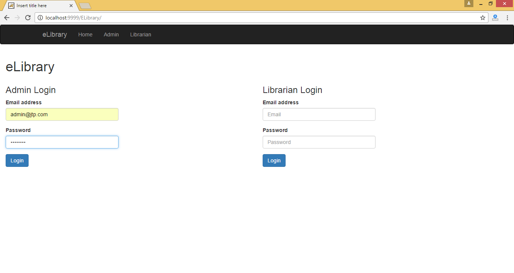 
This is the home page of the application, where you can login as admin or librarian.
For Admin,
If user id and password is correct then:- 
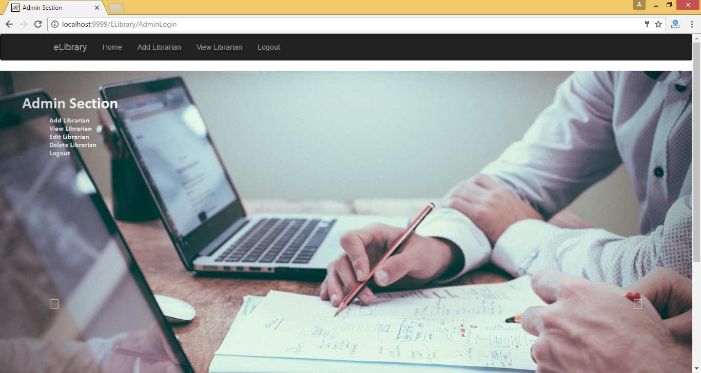 
Then the Admin can add librarian or view librarian.
 
On click on Add Librarian:- 
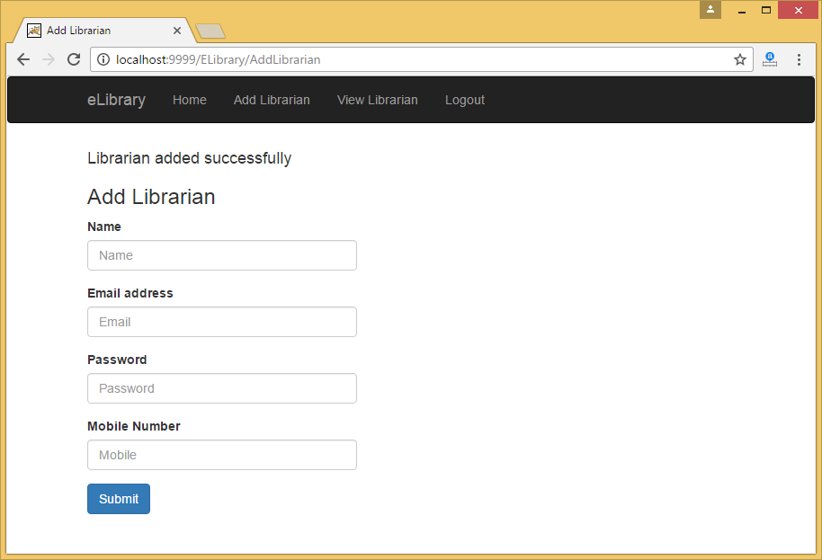 
On click on View Librarian:- 
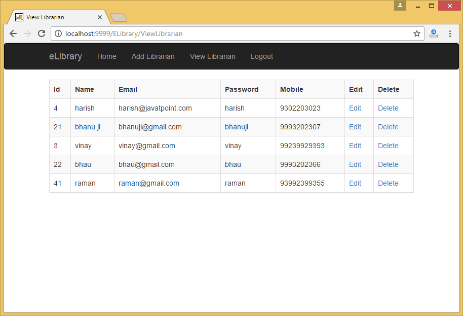 
Here, you can edit or delete librarian. 
 On click on Logout button:-  
 

Login as librarian:-  
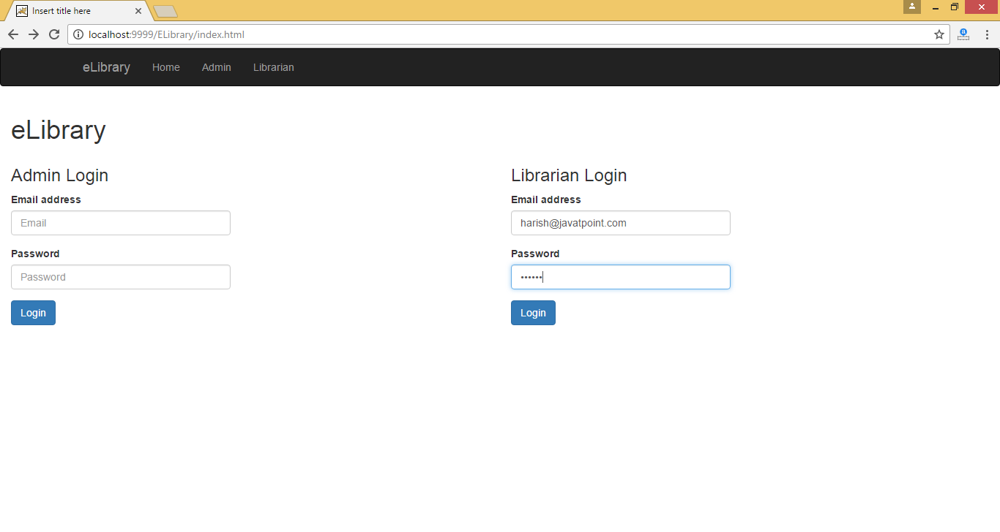
 
On click on Add Book:-  
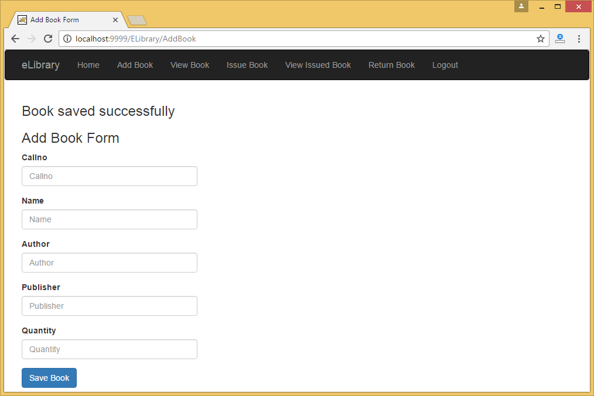 
On click on Issue Book:-  
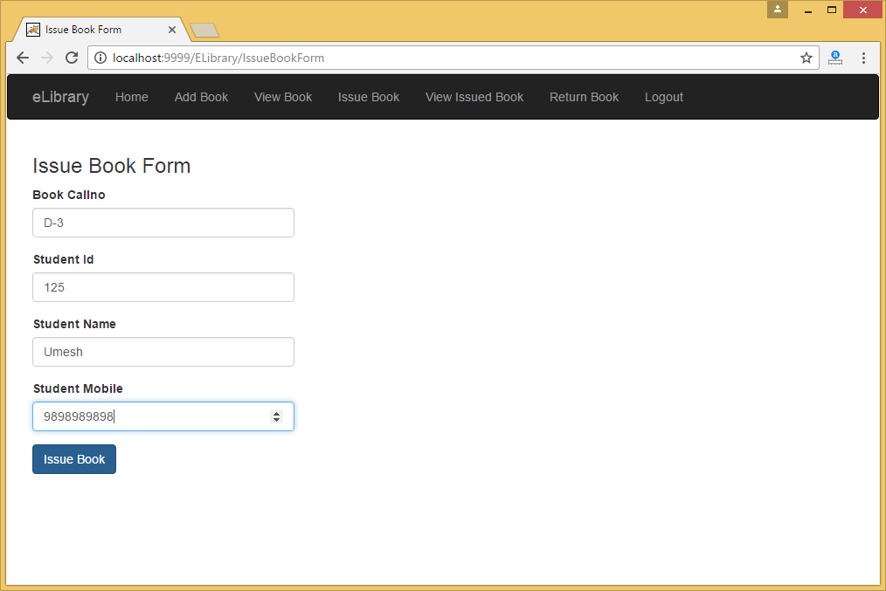 
On click on Return Book:- 
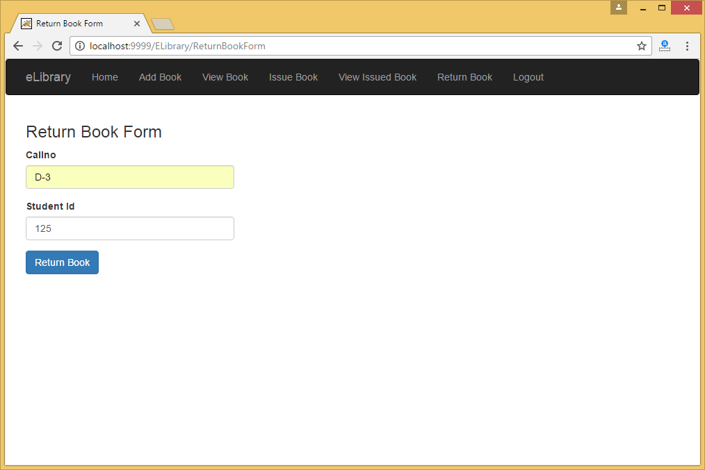 

<b>Sequence Diagram</b> 
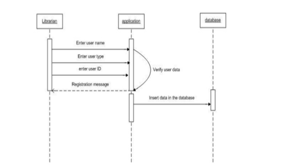 
<b>Class Diagram</b> 
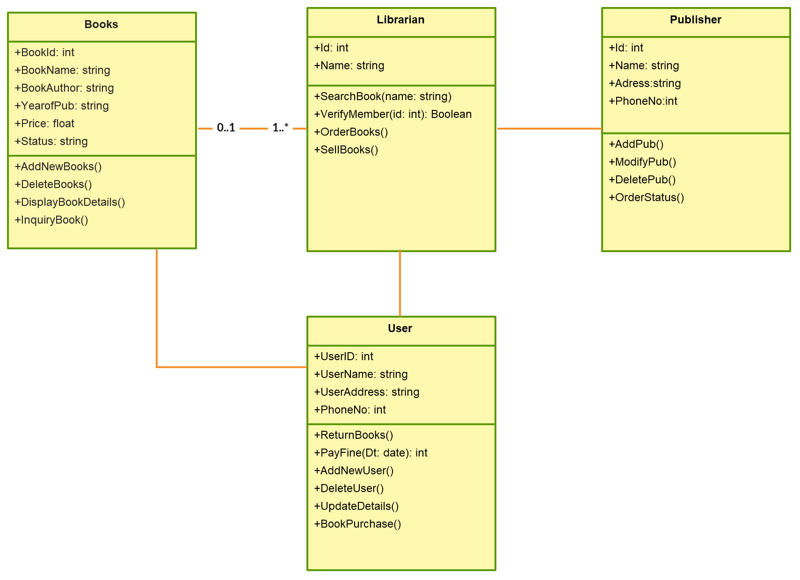 
<b>ER Diagram</b> 
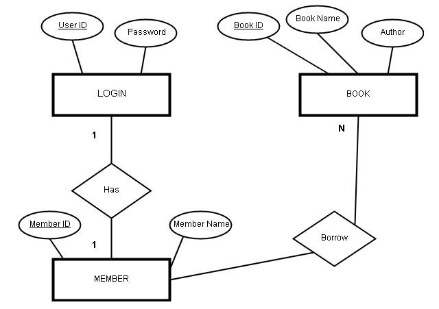 
<b>Data Flow Diagram</b> 
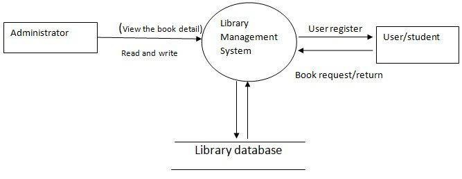 
